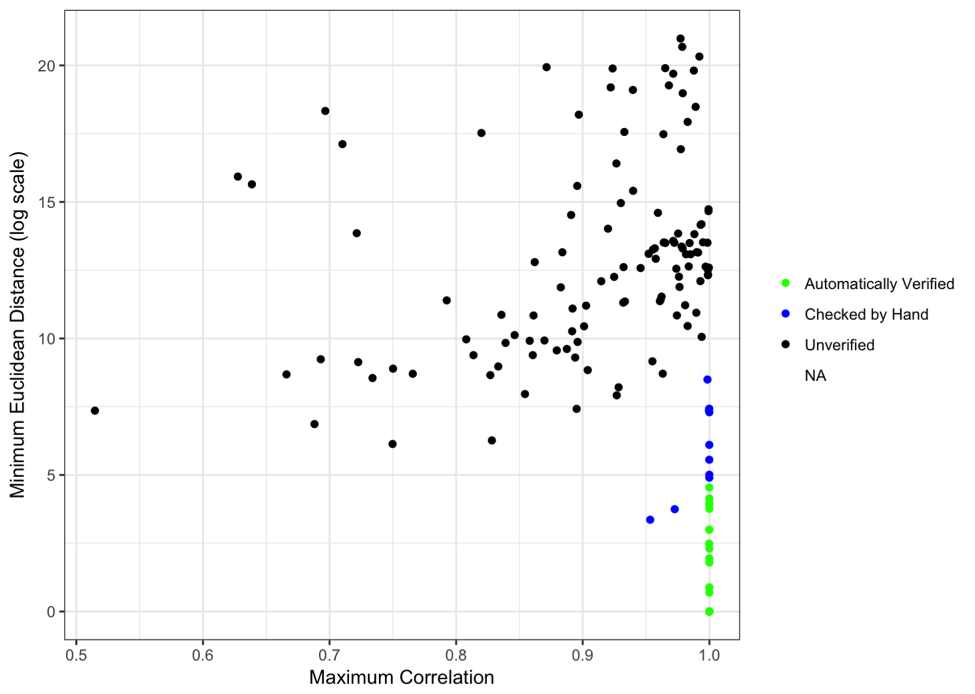
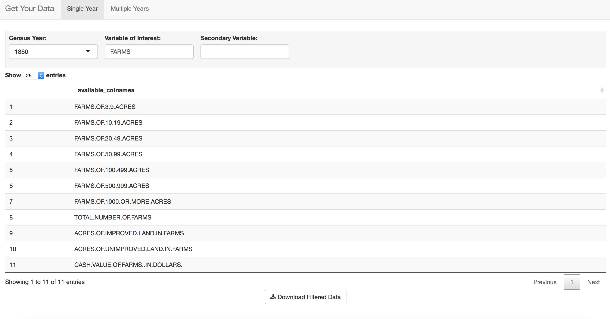
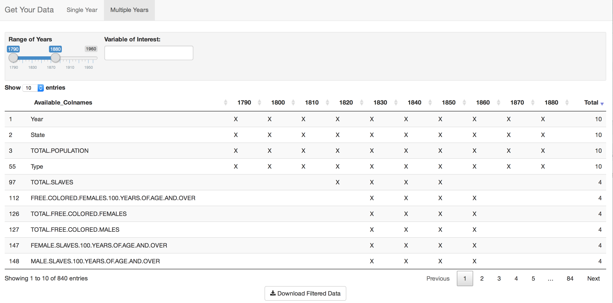

```{r, echo = FALSE}
#Email Univ. of Virginia Library
#  * done, they are going to follow up with more information

#ICPSR 


# Is there a way to set up a warning for variables that might change names over time?
#  * I haven't done this yet.
#  * Mostly with different categories - age category changes over time, so mention that 

#Visualizations 
#  - Compare slaves to free (color scale like election example)
#  * done
#  - Use USAboundaries
#  * done
#  - Facet when using different variables (slaves, free, etc)
#  * kind of done... looks weird
#  - Log scale for numbers?
#  * done, but I would actually prefer a discrete scale
#  * idea: 0, 1-100, 100-500, 501-1000, 1001-5000, 5001-10000, 10001-?? this gets tricky because population grows over time.
#  * divide everything by total number of people in that category in the whole country?
#  * can also look at numbers overall in a time series.


#Write-up


# geom_path, grey90 (close to white), do a background of all the states of the U.S. (1960 map)

# sign up for NHGIS and get county-level data to see how big of a mess it would be (one year or two years)
# create a list in the same way states are done - county1790, county1800, etc. 
# separate download button for county vs. state.
# maybe also get the state-level from 1890 from NHGIS to see if we can match up some of the variable names

# make fig.width wider if we want to put some of the charts next to each other. 

## UPDATES: (4/6/17)
# ICPSR data doesn't give column names. It describes what tables the variables come from, but the .txt file of the data doesn't actually include names.
# NHGIS doesn't have the same 'files'. The variables are not in the same order when you go to select what data you want. 
# U.S. Census Bureau only has available back until 1990 (as far as I can tell)
# Still need to look at making a time series
# Still trying to get the faint outline of the states on my images


## Correlation between variables from spss file and states1890 - to find which ones match (match state names first)
## Also be sure to do the Euclidean distance - correlation is pretty likely anyways because it is a state-to-state, and proportionally the numbers in different states for various variables will be similar. 

## NOTES DURING WRITING : 
  # How do I rotate images? (.pdf from figures folder)
  # How do I get the images to not take up an entire page (ugh)
  # Should I write a function to combine multiple .csv files with different variables from the same year to be exported?
  # Could also write a function to combine multiple different .csv files with varying distinctions for the same demographic group over all time
      # This one could also just be suggesting "use full_join"
  # WTF is the plural of census?
  # Should I do a percentage of total population graphic as well? Perhaps following the abolition of slavery in 1850, this would be something interesting to investigate.
  
```

\section{Introduction}  
Census data is an important snapshot of information about a country at different times throughout their history, one whose value is difficult to overstate.  While history books present a narrative of the events that occured, students often don't get to interact with the raw data themselves in that learning environment. Clean and accessible census data allows the exploration of different demographic groups over time, or investigations of a particular period of time and what the demographic and economic landscape looked like in the past. Even today, data about the world around us opens a pathway for learning more about places we haven't been and groups of people we may not usually engage with.  

From an early point in the United States' history, there were many "eminent men of science" who recognized the value of the census data and worked to aggregate and present the data that had been collected on the population. Francis A. Walker's "Statistical Atlas of the United States", based on the 1870 census, was an impressive effort in aggregating population data to present it in a visually appealing way. Although the Census Bureau's "Statistical Atlases" eventually stopped being made, they were an important start to the effort of visually presenting census data to a wider public.  

Today, as methods of data analysis and visualization continue to be developed and improved, access to census data allows us to look back on that history and explore, synthesize, and visualize the information. When aggregated and presented in a clear manner, viewers can learn more about patterns in many different parts of the population.  

_Mention Dr. Hofmann's paper on recreating/improving the Statistical Atlas here... forthcoming? published? As well as Haley's ggmosaic stuff._

Ever-improving visualization and data-wrangling methods in R [@RCoreTeam] give those interested in statistical graphics a wealth of opportunities to explore and learn from data; in particular, incorporating user interactivity using Shiny has revolutionized the way statisticians share and communicate information [@Shiny]. However, it is difficult to make use of these tools on census data if that data is not available and easy to explore in one location.  

An inherent problem in census data is that a country's census changes over time; the variables collected, how they are collected, and even the locations they are collected on are updated as the country is formed, and subsequently grows and changes. The United States census data is no exception to this rule. In a little under two and a half centuries, the census has taken on many different forms. Data on occupations has transformed as the employment landscape has changed; new states have been formed, the most recent being within the last 100 years; definitions of various demographic groups and the terminology used to describe them have been updated as the demographic makeup of the country has changed. Each decennial census brings a different set of variables to the table. Sometimes these variables are new things the Census Bureau is interested in learning about, while sometimes they remove variables that are no longer relevant or whose information is captured somewhere else.  

Unfortunately, because the founders of the U.S. Census were unable see 200 years into the future, those interested in working with census data are left with quite the inescapable mess. If you want to focus in on a particular demographic group and their journey as part of the population of the United States, you may have ten or more different variables names to describe that one group over the course of the census from 1790 to 1960 - and that is just for one single group! Of course, we cannot just simply change variable names to match our own research needs. It is important to keep the data in its true form and be honest to the way that the population was defined at different times throughout history, even if our instinct may be to 'clean' the data by changing variable names.  

This, of course, leaves the user with a wide variety of variables that are far from consistent across years. In order to track one demographic group across years - let alone many groups - a clean user interface that helps users see exactly what information is available to them is a necessity. To streamline the process and assist researchers in finding out what information they have access to and what information they lack, a U.S. Census Browser for R is presented, with the user interface being a Shiny application, and the downloadable files being 'tidy' comma-separated values (csv) files that those with a minimal amount of R experience should be able to work with.  


\section{Data Access}  

There are two main datasets that contain the aggregated counts of historical, demographic, economic, and social characteristics from the United States decennial census. They were both collected and developed by the Inter-University Consortium for Political and Social Research (ICPSR). The ICPSR 3, gathered from computer-readable data collections from the U.S. Census Bureau as well as other reports (both published and unpublished), contains data from 1790 to 1960. The ICPSR 2896, including much of the same information as the ICPSR 3, also includes a wider array of variables including manufacturing and more county and city-level information. The ICPSR 2896 as a dataset is a restricted access dataset and requires users be part of a member institution in order to gain access to it.  


The University of Virginia Library hosted a "Historical Census Browser" for many years that allowed users to search United States Decennial Census Data for use in research, teaching, and personal inquiry [@HCB]. The data included records on various aspects of the U.S. population from the 1790 Census through the 1960 Census, originally populated using the ICPSR 3 dataset. This Historical Census Browser was free and available for use for anyone with an internet connection. The browser allowed a user to peruse available topics for each census year, at both the state and county levels. The Historical Census Browser was taken down on December 31, 2016, with the county-level aggregated data becoming unavailable several months before this. The source was widely used, with several other university libraries and educational resources including University of California Santa Barbara [@UCSB-US-HCB], University of Pennsylvania [@UPenn-HCB], University of Michigan [@UMich-HCB], and the Smithsonian's History Explorer [@SmithsonianHistoryExplorer] directing researchers to use the University of Virginia site as of 2017.  

The University of Virginia Libraries website now directs users to Social Explorer or the National Historical Geographic Information System (NHGIS) website. Social Explorer, populated with the ICPSR 2896 data, requires that users pay to use (or use through paid library access), and  does not offer a complete download of information. NHGIS, hosted through the University of Minnesota, is very difficult for users to navigate when looking for specific information across multiple years. The Integrated Public Use Microdata Series (IPUMS USA), also hosted by the University of Minnesota, gives microsamples of census data on a finer grid - by person and household. However, this lacks state-aggregated data. The Institute for Social Research at the University of Michigan, which hosts the ICPSR database, has both the full ICPSR 2896 dataset and the full ICPSR 3 dataset. Each of these are split into a separate data set for each year and by split by county-level and state-level. This database requires that users be a part of a member institution, and requires users to agree that they will not distribute the information in any way after gaining access to it. It also does not have any browser function for users to look at the data - they must download the file for each year, in either a SAS, SPSS, ASCII, or Stata format.   

None of the aforementioned resources provide the full advantages that the Historical Census Browser offered: a free-to-use and user-friendly data browser that allows users to choose which data they are interested in using, and download the complete aggregated records for their own independent use. Having the data provided by the Historical Census Browser available once again and streamlined for simple and easy data browsing is a valuable resource for researchers and others alike.    


\section{Work}   

\subsection{Data}  
Although the county-level data had already been removed from the website, the state-level aggregated records for each decennial census from 1790 through 1960 were captured from the website in September of 2016 and saved as raw data with the intent to create a resource for R users that allowed the same main functionalities of the original University of Virginia Historical Census Browser, streamlined for easy data searches and data management.  

The majority of files for the decennial censuses were complete upon capture from the website. However, two years of census data were missing some column names and thus needed to be verified. For the 1890 and 1940 censuses, each column was compared to all columns from the corresponding ICPSR 3 data file by both correlation and Euclidean distance, and thus some columns were able to be correctly identified. The column from ICPSR 3 with the highest correlation and the lowest Euclidean distance to the raw data column in question was identified, and the correlation and distance values recorded. If that column from ICPSR had a correlation greater than .999 and a Euclidean distance below 100 from the raw data column, it was able to be automatically identified as that category. If that column from ICPSR had a correlation greater than .95 and a Euclidean distance below 5000, it was checked by hand. Some of these columns were able to be verified by this process and some were not. All other columns that did not fit these criterion were considered to be unverified data, and were thus removed from the data included in the package. 

A much larger proportion of the 1940 columns were able to be verified than those in 1890. It is important to note that many of the unverified columns in 1890 were most likely farming and manufacturing data, as the ICPSR 3 did not include this information but the original data from the University of Virginia Historical Census Browser included variables of that type. Due to the need to verify using the ICPSR 3, there is a loss of some of the additional information that would have been an asset to the census browser for the 1890 year. This loss is minimal with the 1940 data.  


_Include a table here of numbers for verification _

\begin{table}[H]
\centering

  \begin{tabular}{l|c|c|c|c}
  \hline
  Year & Automatically Verified & Verified by Hand & Unverified & Total \\ \hline
  1890 & 37 & 9 & 121 & 167 \\ 
  1940 & 349 & 8 & 24 & 381 \\ 
  \end{tabular}

  \caption{Counts of variables after going through the verification process.}
  \label{verify-table}
\end{table}


{ width=70% }  


Each year of the dataset began in a separate file, with each row corresponding to a State, each column being a demographic variable, and values being state-aggregated counts of number of people in that category. Each state was given a label `Type` as either a State or Territory, as some U.S. territories participated in the decennial census before they received full statehood. Each individual file can be found as `states` followed by the year of the census, (e.g. `states1790`) in this package. Each of these datasets were combined into one list, `stateslist`, which is the list of data that is used to populate the census browser.  


\subsection{Description}  

This package includes the state-aggregated data for each individual year, as well as a list of all of the years together. The intended interaction with these data sources is via the Shiny application, `Get Your Data`. This interactive Shiny application presents the user with two options - focusing on a single year of the census, found in the `Single Year` tab, or focusing on multiple years at once, found in the `Multiple Years` tab.  

The `Single Year` tab allows users to choose which year they are interested in from a drop-down menu, as well as two manual search entry boxes for variables of interest. For example, if a user is interested in the prevalence of farms in 1860, they can select 1860 and then search for "farms" in the first "Variable of Interest" field (see Figure 2). Users can then see a complete list of all variable names in that particular year that have "farms" in their title. With this list now available, users can select each variable they want by clicking on it. Once all desired variables have been selected, clicking on the "Download Filtered Data" button will open a window in which the user can choose a file name and directory location for saving the resulting comma-separated values file. Variables will not remain selected if the user chooses to change their search term or add a second search term. However, if the user has interest in many separate variables that require different search terms, it is quite easy to combine multiple csv files in R using `full_join` from the `dplyr` package and specifying `State`, `Year`, `TOTAL.POPULATION`, and `Type` as the variables to join by. These four variables will always be included in the resulting csv file, whether the user selects them or not.   

```{r, echo = F, fig.width = 8, fig.pos =  "H", fig.cap = "The resulting view of a search for farms in the 1860 U.S. Census on the `Single Year` tab of the `Get Your Data` app."}

```


The `Multiple Years` tab allows users to look for variables of interest over a range of years. It offers all decennial censuses from 1790 to 1960, and offers the same search tool as before, but only allows users to narrow down results by one search term rather than the two provided in the `Single Year` tab. Users can select the range of years they are interested in by using the slider tool to specify their range of interest, and subsequently use the "Variable of Interest" search bar to narrow down their results. The results, being two-dimensional rather than just a single list of available variables, are presented somewhat differently in the `Multiple Years` tab. Each available variable is listed along the left side of the interface, and each selected year is presented across the top as a column in the table (see Figure 3). For each variable in the table, an `X` indicates for which years that particular variable is present. Far to the right, there is a column which denotes a count how many of the selected years have that particular variable. Users can choose to order the results by most years present to least years present, if they choose. This is where it is important to keep in mind that variable names for different demographic groups change drastically over the course of the decennial census, and thus users will want to be cognizant of varying search terms that may need to be checked. _I added a feature that pops up when they look for certain search terms. Right now, it only captures two different groups - the one in the example and then the differences between age groups. Should probably incorporate more of these in order to actually claim the element is there._  

Similar to the output file of the `Single Year` tab, once a user selects all variables they are interested in, they can select the "Download Filtered Data" button to download a csv file of the chosen variables for all states across the selected years. For years in the selected range that don't have a particular variable, the csv file will be filled in with `NA` values, which allows the structure of the data table to remain intact although there are some year-variable combinations that do not exist in the data. As mentioned previously, because of the changing nature of variable names in the decennial census, users may have to search for several separate terms, download each file separately, and combine them once the files are downloaded. This process can be done in the same manner as the combination However, they are fairly easy to combine because the structure ensures that key variables needed to add on new columns are in place, regardless of which variables users choose to download. This results in all information about all variables of interest across the years of interest being together in one data table, with each row representing a year-state combination and all variables of interest represented as columns. Users can easily filter on specific variables or years while still maintaining the original full data set, which is advantageous for visualizing how a demographic group changes over time.  


\subsection{Example}  

The `Get Your Data` Shiny app can be easily used to search for a topic, find the data of interest, download state-level information, and tell a visual story of populations in the United States over time. To demonstrate the utility of this Shiny app, we will walk through an example on the history of the African American population in the United States. We begin by running the Shiny app: 

```{r, eval=FALSE}
library(shiny)
shiny::runGitHub("kiegan/censusbrowseR", subdir = "shiny")
```

The default set of years is 1790 to 1880. However, the slider range can be expanded to be able to explore data across all the available years.  

  

After ordering by how many years they appear in, the available variable names show a serious lack of continuity. The four ever-present variables (`Year`, `State`, `TOTAL.POPULATION`, and `Type`) each appear ten times, once in each year selected. After that, the next most common variable only appears in four of the ten years we have chosen. That immediately demonstrates some pretty significant hurdles that will persist when tracking any demographic group over time, without even focusing in on a particular group yet.  

Since the focus is on African Americans throughout U.S. history, the first search term needed is `SLAVE` in the early years of the U.S. census. The vast majority of African Americans were slaves when the United States was founded, so variables that count the number of slaves are important variables to have in order to get a grasp on the African American population in early U.S. history. It is important to note that the `SLAVE` categorization is the only term the U.S. census had related to African Americans in the early years of the census, so it is also the only source of information available on that group for that time period.  


Once a relevant range of years has been chosen, we simply enter a search term. Searching for `SLAVE` gives a list of all the possible variable names across all years, which can again be sorted by how how many years each variable name appears in. The results of this search can be seen in Figure 4.  


For this example, three separate searches were executed within the `Get Your Data` app, using three different terms that the census used to categorize African Americans at different points in the decennial census ("slave", "colored", and "negro"). The third of these terms, when used in plotting, will be labeled as "black" for the remainder. This gave three separate csv files, which were easily combined using `full_join` from the `dplyr` package. Now, for this demographic group, all of the state-aggregated population counts are together in one data frame, although different terms are used at different points in time.  

```{r, echo = FALSE, warning = FALSE, message = FALSE}
library(statatlas)
library(tidyverse)
library(USAboundaries)
library(broom)
library(maptools)
library(gridExtra)
library(ggthemes)
library(scales)
data_c <- readr::read_csv("./counts-using-word-colored.csv")
data_s <- readr::read_csv("./counts-using-word-slave.csv")
data_n <- readr::read_csv("./counts-using-word-negro.csv")

data_full <- full_join(data_s, data_c, by = c("Year", "State", "TOTAL.POPULATION", "Type"))
#data_full %>% glimpse

data_full <- full_join(data_full, data_n, by = c("Year", "State", "TOTAL.POPULATION", "Type"))
#data_full %>% glimpse


states_current <- us_boundaries("1999-12-31")
mcurr_df <- fortify(states_current, region = "name")
mcurr_df <- mcurr_df %>% mutate(State = toupper(id)) %>% filter(long >= -127)

```


The data, being combined, can now be explored. For any particular year, a subset of the total dataset can be taken to include only information for that year, for quicker determination of which variables are available for that particular year. For example, after subsetting on the year 1790,  state-level counts of the `SLAVES` variable for that year can be plotted. Use of the `USAboundaries` package in concert with this census browser is recommended, as it provides the most accurate boundaries of the United States at any given date [@USAboundaries]. Just as variable names and the make-up of the census rapidly changed throughout the United States' history, the boundaries of the states and territories changed as well. The recorded state-aggregated values in the dataset are for the states as they were during that census year, and thus sometimes include demographic counts from areas that differ from the currently defined boundaries.  


```{r chunk-1790-map, fig.width = 6.66, fig.height = 4, echo = FALSE, message = FALSE, warning = FALSE, fig.pos = "H", fig.cap = "Total number of slaves per state in 1790, plotted on a continuous log scale. State boundaries for July 4, 1790 were gathered from `USAboundaries` package."}
map_states_1790 <- us_boundaries("1790-07-04")

m1790_df <- fortify(map_states_1790, region = "name")
m1790_df <- m1790_df %>% mutate(State = toupper(id))
#anti_join(data_full, m1790_df, by = "State")
data_full_wmap <- full_join(data_full, m1790_df, by = "State")

#data_full_wmap %>% glimpse


#data_full_wmap %>% filter(Year == 1790) %>% summary()
  # this tells us that the only variable recorded this year is 'SLAVES'. We will use that.

#data_full_wmap %>%
#  filter(Year == 1790) %>% 
#  ggplot(aes(x = long, y = lat, group = group)) + 
#  geom_polygon(aes(fill = log(SLAVES)), colour = "black") + 
#  theme_bw() + theme(legend.title = element_blank()) + labs(title = "Total Slaves (log scale)")

data_full_wmap_1790 <- data_full_wmap %>% filter(Year == 1790)

ggplot() + geom_polygon(data = mcurr_df, aes(x = long, y = lat, group = group), 
                        colour = "grey90", fill = "white") + ggthemes::theme_map() + 
  geom_polygon(data = data_full_wmap_1790, 
               aes(x = long, y = lat, group = group, fill = SLAVES)) + 
  scale_fill_gradient(trans = "log10", labels = comma) +
  theme(legend.title = element_blank(), legend.background = element_rect(fill = "transparent")) + 
  labs(title = "Total Slaves", x = "", y = "") 
```

Now, with a visualization of the slave population in the United States in 1790 in hand, it is easy to look at subsequent years of the decennial census in a similar manner to see how the population changes over time.  


```{r, fig.width = 8.33, fig.height = 5, echo = FALSE, message = FALSE, warning = FALSE, fig.pos = "H", fig.cap = "Number of Slaves, Number of Free Colored Persons, and Percentage of Free Colored Persons in 1820."}
map_states_1820 <- us_boundaries("1820-07-04")

m1820_df <- fortify(map_states_1820, region = "name")
m1820_df <- m1820_df %>% mutate(State = toupper(id))
#anti_join(data_full, m1820_df, by = "State")
data_full_wmap <- full_join(data_full, m1820_df, by = "State")

#data_full_wmap %>% glimpse

#data_full_wmap %>% filter(Year == 1820) %>% summary()
  # now we have 'TOTAL.SLAVES' and 'TOTAL.FREE.COLORED.PERSONS'

data_full_wmap <- data_full_wmap %>% 
  mutate(PERC.AFRICAN.AMERICANS.FREE = TOTAL.FREE.COLORED.PERSONS/(TOTAL.FREE.COLORED.PERSONS+TOTAL.SLAVES))

data_full_wmap_1820 <- data_full_wmap %>% filter(Year == 1820)

p1_1820 <- ggplot() + geom_polygon(data = mcurr_df, aes(x = long, y = lat, group = group), 
                        colour = "grey90", fill = "white") + ggthemes::theme_map() + 
  geom_polygon(data = data_full_wmap_1820, 
               aes(x = long, y = lat, group = group, fill = TOTAL.SLAVES)) + 
  scale_fill_gradient(trans = "log10", labels = comma, limit = range(1, max(data_full_wmap_1820$TOTAL.SLAVES))) + 
  labs(title = "Total Slaves", x = "", y = "") + 
  theme(legend.title = element_blank(), legend.background = element_rect(fill = "transparent"))

#p1_1820 <- data_full_wmap %>%
#  filter(Year == 1820) %>% 
#  ggplot(aes(x = long, y = lat, group = group)) + 
#  geom_polygon(aes(fill = log(TOTAL.SLAVES)), colour = "black") + 
#  theme_bw() + labs(title = "Total Slaves (log scale)") + theme(legend.title = element_blank())

p2_1820 <- ggplot() + geom_polygon(data = mcurr_df, aes(x = long, y = lat, group = group), 
                        colour = "grey90", fill = "white") + ggthemes::theme_map() + 
  geom_polygon(data = data_full_wmap_1820, 
               aes(x = long, y = lat, group = group, fill = TOTAL.FREE.COLORED.PERSONS)) +
  scale_fill_gradient(trans = "log10", labels = comma, limit = range(1,max(data_full_wmap_1820$TOTAL.SLAVES))) + 
  labs(title = "Total Free Colored Persons", x = "", y = "") + 
  theme(legend.title = element_blank(), legend.background = element_rect(fill = "transparent"))

#p2_1820 <- data_full_wmap %>% 
#  filter(Year == 1820) %>%
#  ggplot(aes(x = long, y = lat, group = group)) + 
#  geom_polygon(aes(fill = log(TOTAL.FREE.COLORED.PERSONS)), colour = "black") + 
#  theme_bw() + labs(title = "Total Free Colored Persons (log scale)") + theme(legend.title = element_blank())

p3_1820 <- ggplot() + geom_polygon(data = mcurr_df, aes(x = long, y = lat, group = group), 
                        colour = "grey90", fill = "white") + ggthemes::theme_map() + 
  geom_polygon(data = data_full_wmap_1820, 
               aes(x = long, y = lat, group = group, fill = PERC.AFRICAN.AMERICANS.FREE)) + 
  labs(title = "Percent of Colored Persons Free", x = "", y = "") + 
  theme(legend.title = element_blank(), legend.background = element_rect(fill = "transparent")) +
  scale_fill_gradient2(midpoint = .5)

#p3_1820 <- data_full_wmap %>% 
#  filter(Year == 1820) %>%
#  ggplot(aes(x = long, y = lat, group = group)) + 
#  geom_polygon(aes(fill = PERC.AFRICAN.AMERICANS.FREE), colour = "black") + 
#  theme_bw() + labs(title = "Percent of Colored Persons Free") + scale_fill_gradient2(midpoint = .5) + theme(legend.title = #element_blank())

#p1_1820
#p2_1820
#p3_1820

grid.arrange(p1_1820, p2_1820, p3_1820, ncol = 2)
```

Jumping to the year 1820, and again filtering on that particular year, we learn new information about the African American population. The census at this time includes a count of `TOTAL.FREE.COLORED.PERSONS`, as there are citizens who are African American or other minorities that are free, and not slaves. At this time, many minorities were grouped together in the "colored persons" category, and as before, we do not have any other record for African Americans except this categorization and the "slaves" categorization. However, since the 1820 census included records for both `TOTAL.FREE.COLORED.PERSONS` and `TOTAL.SLAVES`, we can also now visualize the percentage of African Americans in each state that were categorized as "free persons" as opposed to slaves. Knowing that both of these variables are available allows for a powerful comparison by visualizing the growing divide in the United States at that time.  

```{r, fig.width = 8.33, fig.height = 5, echo = FALSE, message = FALSE, warning = FALSE, fig.pos = "H", fig.cap = "Number of Slaves, Number of Free Colored Persons, Percentage of Free Colored Persons, and Total African American Persons in 1850."}
map_states_1850 <- us_boundaries("1850-07-04")

m1850_df <- fortify(map_states_1850, region = "name")
m1850_df <- m1850_df %>% mutate(State = toupper(id))
#anti_join(data_full, m1850_df, by = "State")
data_full_wmap <- full_join(data_full, m1850_df, by = "State")

#data_full_wmap %>% glimpse

#data_full_wmap %>% filter(Year == 1850) %>% summary()
  # here we have 'TOTAL.SLAVES' and 'TOTAL.FREE.COLORED.POPULATION'. I assume 'TOTAL.FREE.COLORED.POPULATION' is just a different way to see 'TOTAL.FREE.COLORED.PERSONS'. Small wording changes like this happen a lot in the census data!


# We also now have many northern states who do not report slaves as part of their census, since they were considered free states 
## look up the laws about this 

# We will turn 'NA' values for 'TOTAL.SLAVES' to 0 in a new variable called 'TOTAL.SLAVES.ZERO' so that we can continue to calculate the ratio of slaves to free. (We just assume 0 slaves in Free States)

data_full_wmap <- data_full_wmap %>% mutate(TOTAL.SLAVES.ZERO = ifelse(is.na(TOTAL.SLAVES),0,TOTAL.SLAVES))

data_full_wmap <- data_full_wmap %>% 
  mutate(PERC.AFRICAN.AMERICANS.FREE = TOTAL.FREE.COLORED.POPULATION/(TOTAL.FREE.COLORED.POPULATION+TOTAL.SLAVES.ZERO))


data_full_wmap_1850 <- data_full_wmap %>% filter(Year == 1850)


legend_max <- max(data_full_wmap_1850$TOTAL.SLAVES.ZERO + data_full_wmap_1850$TOTAL.FREE.COLORED.POPULATION)


p1_1850 <- ggplot() + geom_polygon(data = mcurr_df, aes(x = long, y = lat, group = group), 
                        colour = "grey90", fill = "white") + ggthemes::theme_map() + 
  geom_polygon(data = data_full_wmap_1850, 
               aes(x = long, y = lat, group = group, fill = TOTAL.SLAVES)) +
  scale_fill_gradient(trans = "log10", labels = comma, 
                      limit = range(1,legend_max)) + 
  labs(title = "Total Slaves", x = "", y = "") + 
  theme(legend.title = element_blank(), legend.background = element_rect(fill = "transparent"))


p2_1850 <- ggplot() + geom_polygon(data = mcurr_df, aes(x = long, y = lat, group = group), 
                        colour = "grey90", fill = "white") + ggthemes::theme_map() + 
  geom_polygon(data = data_full_wmap_1850, 
               aes(x = long, y = lat, group = group, fill = TOTAL.FREE.COLORED.POPULATION)) +
  scale_fill_gradient(trans = "log10", labels = comma, 
                      limit = range(1, legend_max)) + 
  labs(title = "Total Free Colored Persons", x = "", y = "") + 
  theme(legend.title = element_blank(), legend.background = element_rect(fill = "transparent"))


p3_1850 <- ggplot() + geom_polygon(data = mcurr_df, aes(x = long, y = lat, group = group), 
                        colour = "grey90", fill = "white") + ggthemes::theme_map() + 
  geom_polygon(data = data_full_wmap_1850, 
               aes(x = long, y = lat, group = group, fill = PERC.AFRICAN.AMERICANS.FREE)) + 
  labs(title = "Percent of Colored Persons Free", x = "", y = "") + 
  theme(legend.title = element_blank(), legend.background = element_rect(fill = "transparent")) +
  scale_fill_gradient2(midpoint = .5)


p4_1850 <- ggplot() + geom_polygon(data = mcurr_df, aes(x = long, y = lat, group = group), 
                        colour = "grey90", fill = "white") + ggthemes::theme_map() + 
  geom_polygon(data = data_full_wmap_1850, 
               aes(x = long, y = lat, group = group, fill = TOTAL.FREE.COLORED.POPULATION + TOTAL.SLAVES.ZERO)) + 
  scale_fill_gradient(trans = "log10", labels = comma, limit = range(1, legend_max)) +
  labs(title = "Total Slave and Free Colored Persons", x = "", y = "") +
  theme(legend.title = element_blank(), legend.background = element_rect(fill = "transparent")) 


grid.arrange(p1_1850, p2_1850, p3_1850, p4_1850, ncol = 2)
```

Moving forward from there, even more information can be gleaned about this population. After subsetting on the year 1850, it is seen that although there is still a `TOTAL.SLAVES` column in the record, many states did not record this variable, as they were already free states. We can transform these `NA` values into zeros to account for this difference in the data and allow us to still calculate the percentages of free African Americans. Starting in 1850, we can also start investigating what the total African American population looks like in each state, rather than just the slave population and free population.   


```{r, fig.width = 8.33, fig.height = 5, echo = FALSE, message = FALSE, fig.pos = "H", fig.cap = "Total Colored Persons in 19th Century United States"}

legend_max <- 1000000

p5_1850 <- ggplot() + geom_polygon(data = mcurr_df, aes(x = long, y = lat, group = group), 
                        colour = "grey90", fill = "white") + ggthemes::theme_map() + 
  geom_polygon(data = data_full_wmap_1850, 
               aes(x = long, y = lat, group = group, fill = TOTAL.FREE.COLORED.POPULATION + TOTAL.SLAVES.ZERO)) +
  scale_fill_gradient(trans = "log10", labels = comma, limit = range(1, legend_max)) + 
  labs(title = "1850", x = "", y = "") + 
  theme(legend.position = "none") 


map_states_1860 <- us_boundaries("1860-07-04")

m1860_df <- fortify(map_states_1860, region = "name")
m1860_df <- m1860_df %>% mutate(State = toupper(id))
data_full_wmap <- full_join(data_full, m1860_df, by = "State")

data_full_wmap <- data_full_wmap %>% mutate(AGGR..SLAVES.ZERO = ifelse(is.na(AGGR..SLAVES),0,AGGR..SLAVES))

data_full_wmap <- data_full_wmap %>% 
  mutate(PERC.AFRICAN.AMERICANS.FREE = 
           (TOTAL.FREE.COLORED.MALES + TOTAL.FREE.COLORED.FEMALES)/
           (TOTAL.FREE.COLORED.MALES + TOTAL.FREE.COLORED.FEMALES + AGGR..SLAVES.ZERO))

data_full_wmap_1860 <- data_full_wmap %>% filter(Year == 1860)

p4_1860 <- ggplot() + geom_polygon(data = mcurr_df, aes(x = long, y = lat, group = group), 
                        colour = "grey90", fill = "white") + ggthemes::theme_map() + 
  geom_polygon(data = data_full_wmap_1860, 
               aes(x = long, y = lat, group = group, 
                   fill = TOTAL.FREE.COLORED.MALES + TOTAL.FREE.COLORED.FEMALES + AGGR..SLAVES.ZERO)) + 
  scale_fill_gradient(trans = "log10") + 
  labs(title = "1860", x = "", y = "") + 
  theme(legend.position = "none")


map_states_1870 <- us_boundaries("1870-07-04")

m1870_df <- fortify(map_states_1870, region = "name")
m1870_df <- m1870_df %>% mutate(State = toupper(id))
#anti_join(data_full, m1870_df, by = "State")
data_full_wmap <- full_join(data_full, m1870_df, by = "State")
data_full_wmap_1870 <- data_full_wmap %>% filter(Year == 1870)

p4_1870 <- ggplot() + geom_polygon(data = mcurr_df, aes(x = long, y = lat, group = group),
                        colour = "grey90", fill = "white") + ggthemes::theme_map() + 
  scale_fill_gradient(trans = "log10", labels = comma, limit = range(1, legend_max)) + 
  geom_polygon(data = data_full_wmap_1870, aes(x = long, y = lat, group = group, fill = COLORED.PERSONS)) + 
  labs(title = "1870", x = "", y = "") + 
  theme(legend.title = element_blank(), legend.background = element_rect(fill = alpha("white", 0.6)), 
        legend.key.size = unit(.45, "cm"), legend.text = element_text(size = 6), legend.position = c(-.01, 0))

map_states_1880 <- us_boundaries("1880-07-04")

m1880_df <- fortify(map_states_1880, region = "name")
m1880_df <- m1880_df %>% mutate(State = toupper(id))
#anti_join(data_full, m1880_df, by = "State")
data_full_wmap <- full_join(data_full, m1880_df, by = "State")
data_full_wmap_1880 <- data_full_wmap %>% filter(Year == 1880)

p4_1880 <- ggplot() + geom_polygon(data = mcurr_df, aes(x = long, y = lat, group = group),
                        colour = "grey90", fill = "white") + ggthemes::theme_map() + 
  geom_polygon(data = data_full_wmap_1880, aes(x = long, y = lat, group = group, fill = COLORED.PERSONS)) + 
  scale_fill_gradient(trans = "log10", labels = comma, limit = range(1, legend_max)) + 
  labs(title = "1880", x = "", y = "") + 
  theme(legend.position = "none")
  
  
grid.arrange(p5_1850, p4_1860, p4_1870, p4_1880, ncol = 2, top = "Total Colored Persons")
```

The total African American population is particularly interesting moving forward as well after slavery is abolished in the 1860s and some migration begins to occur out of certain areas. The balance of the total African American population in each state begins to change somewhat as the United States transitions into the post-slavery period. It is also clear to see how the boundaries of states change and new states are formed, with the United States gaining new states at each census.  


```{r, fig.width = 8.33, fig.height = 5, echo = FALSE, message = FALSE, warning = FALSE, fig.pos = "H", fig.cap = "Total Black Persons in 20th Century United States"}  

legend_max <- 2000000
map_states_1900 <- us_boundaries("1900-07-04")
m1900_df <- fortify(map_states_1900, region = "name")
m1900_df <- m1900_df %>% mutate(State = toupper(id))
#anti_join(data_full, m1900_df, by = "State")
data_full_wmap <- full_join(data_full, m1900_df, by = "State")
data_full_wmap_1900 <- data_full_wmap %>% filter(Year == 1900)


p1_1900 <- ggplot() + geom_polygon(data = mcurr_df, aes(x = long, y = lat, group = group), 
                        colour = "grey90", fill = "white") + ggthemes::theme_map() + 
  geom_polygon(data = data_full_wmap_1900, 
               aes(x = long, y = lat, group = group, fill = NEGRO.FEMALES + NEGRO.MALES)) + 
  scale_fill_gradient(trans = "log10", labels = comma, limit = range(1, legend_max)) + 
  labs(title = "1900", x = "", y = "") + 
  theme(legend.position = "none")

map_states_1910 <- us_boundaries("1910-07-04")
m1910_df <- fortify(map_states_1910, region = "name")
m1910_df <- m1910_df %>% mutate(State = toupper(id))
#anti_join(data_full, m1910_df, by = "State")
data_full_wmap <- full_join(data_full, m1910_df, by = "State")
data_full_wmap_1910 <- data_full_wmap %>% filter(Year == 1910)

p1_1910 <- ggplot() + geom_polygon(data = mcurr_df, aes(x = long, y = lat, group = group), 
                        colour = "grey90", fill = "white") + ggthemes::theme_map() + 
  geom_polygon(data = data_full_wmap_1910, 
               aes(x = long, y = lat, group = group, fill = TOTAL.NEGROES)) + 
  scale_fill_gradient(trans = "log10", labels = comma, limit = range(1, legend_max)) + 
  labs(title = "1910", x = "", y = "") + theme(legend.position = "none")


map_states_1920 <- us_boundaries("1920-07-04")
m1920_df <- fortify(map_states_1920, region = "name")
m1920_df <- m1920_df %>% mutate(State = toupper(id))
#anti_join(data_full, m1920_df, by = "State")
data_full_wmap <- full_join(data_full, m1920_df, by = "State")
data_full_wmap_1920 <- data_full_wmap %>% filter(Year == 1920)

p1_1920 <- ggplot() + geom_polygon(data = mcurr_df, aes(x = long, y = lat, group = group), 
                        colour = "grey90", fill = "white") + ggthemes::theme_map() + 
  geom_polygon(data = data_full_wmap_1920, 
               aes(x = long, y = lat, group = group, fill = MALE.NEGROES + FEMALE.NEGROES)) + 
  scale_fill_gradient(trans = "log10", labels = comma, limit = range(1, legend_max)) + 
  labs(title = "1920", x = "", y = "") + 
  theme(legend.title = element_blank(), legend.background = element_rect(fill = alpha("white", 0.6)), 
        legend.key.size = unit(.45, "cm"), legend.text = element_text(size = 6), legend.position = c(-.01, 0))

map_states_1930 <- us_boundaries("1930-07-04")
m1930_df <- fortify(map_states_1930, region = "name")
m1930_df <- m1930_df %>% mutate(State = toupper(id))
#anti_join(data_full, m1930_df, by = "State")
data_full_wmap <- full_join(data_full, m1930_df, by = "State")
data_full_wmap_1930 <- data_full_wmap %>% filter(Year == 1930)

p1_1930 <- ggplot() + geom_polygon(data = mcurr_df, aes(x = long, y = lat, group = group), 
                        colour = "grey90", fill = "white") + ggthemes::theme_map() + 
  geom_polygon(data = data_full_wmap_1930, 
               aes(x = long, y = lat, group = group, fill = NEGRO.FEMALES + NEGRO.MALES)) + 
  scale_fill_gradient(trans = "log10", labels = comma, limit = range(1, legend_max)) + 
  labs(title = "1930", x = "", y = "") + 
  theme(legend.position = "none")


grid.arrange(p1_1900, p1_1910, p1_1920, p1_1930, ncol = 2, top = "Total Black Persons")
```


A period of growth and change can be seen at the turn of the 20th century as well, with a dramatic shift in the African American population out west to California and with the balance in the east and midwest shifting slightly further north. Although the highest density still remains in the southern states, somewhat of a northern migration is visible.   


\section{Discussion}  
Although there is a lack of county-level data and the available data for the census browser is only as recent as 1960, users are able to efficiently find a group of interest at different points in U.S. history, collect all of the relevant variables over time, and tell a visual story about a growing nation and a changing population. This connectivity across years and ability to assess what information was available all in one browser demonstrates the time that could be saved by researchers interested in delving into United States history.  

As seen with the discrepancy in recording the `TOTAL.SLAVES` variable in the 1850 census, the layout also assists in quicker determination of not only which variables are available, but where information is missing for some states on a particular variable. Finding these differences is made much easier by having all relevant variables in one data frame, which can be summarized and searched all at one time.  


\section{Future Work}  

In order to be able to investigate even more complex patterns in United States history, having a finer grid of information - specifically county-level data - would be extremely valuable. There are inherent challenges with a more complex set of data such as county-level, which promises lack of continuity across counties and states. Another big challenge would be creating a carefully constructed layout in which users can interact with not only years, but differences across locales to find the most complete information. Despite these expected challenges, adding county-level data to this browser would give researchers a much richer resource to work with.  

Just as there were many changes in the census between 1790 and 1960, the census adapts and changes with each passing year. Different variables are tracked, congressional boundaries change, and the demographic landscape of the United States changes as well. Having current data (through 2010) and being able to incorporate future data as it is collected would allow for the juxtaposition of today's population with that of the past. Being able to put history into context is an important skill, and one that an up-to-date census browser could help facilitate for students and researchers alike.   


\section{References}  


